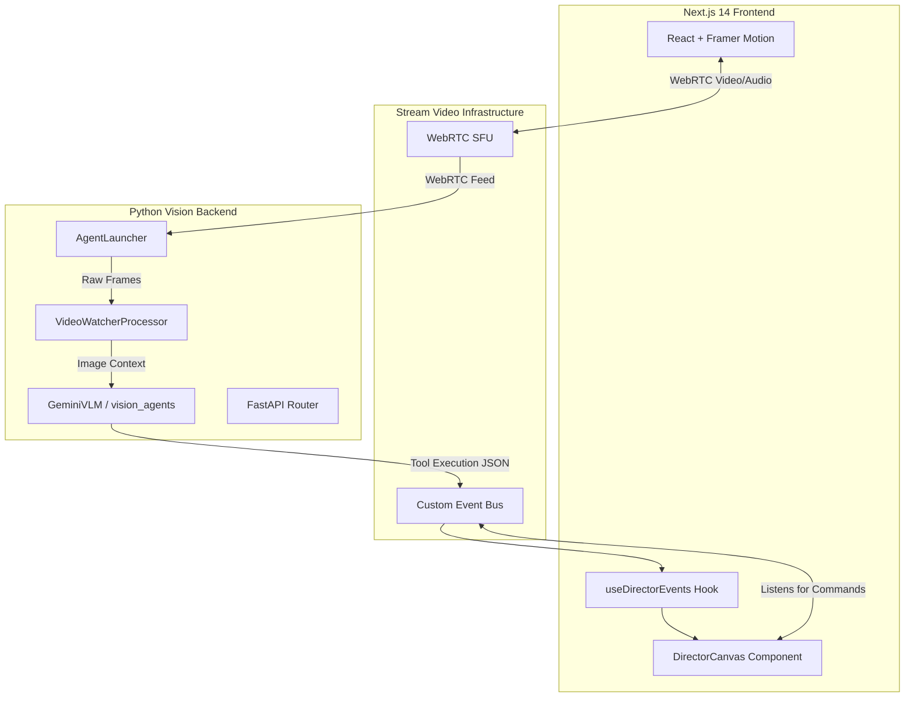

<div align="center">


# 🎬 The Semantic Cinematographer

**The world's first real-time AI-directed video recording studio.**

[](https://nextjs.org/)
[](https://fastapi.tiangolo.com/)
[](https://getstream.io/video/)
[](https://github.com/landing-ai/vision-agents)
[](#)

_Your camera is on. Your AI Director is watching. Every gesture, every word — directed in real time._

[View Demo Recording](#) • [System Architecture](#system-architecture) • [Features](#features) • [Installation](#quick-start)

---

</div>

## 🌌 The Vision

We aren't just building another video-calling app. We are building a **live, multimodal AI processing pipeline** that acts as your personal cinematographer. The Semantic Cinematographer analyzes your raw WebRTC video frames via **Gemini 2.0 Flash**, interprets physical gestures, and fires autonomous UI mutations (zooms, cinematic color grading, screen shakes, semantic captions) in sub-second latency.

This is the future of content creation: zero editing, zero post-production. _Just hit record._

## ⚡ Core Features

| Feature                            | Technical Implementation                      | Impact                                                                                               |
| :--------------------------------- | :-------------------------------------------- | :--------------------------------------------------------------------------------------------------- |
| **🔍 Autonomous Auto-Zoom**        | `adjust_zoom` tool call via `GeminiVLM`       | Automatically punches in for close-ups during emphatic moments.                                      |
| **🎨 Real-time Cinematic Grading** | CSS Matrix mutations via Stream Custom Events | Shifts from "Noir" to "Neon" based on the spoken context or visual mood.                             |
| **🫨 Semantic Screen Shake**       | Framer Motion animations bound to Hook state  | Reacts to high-energy statements or visual impact with visceral camera shake.                        |
| **💬 Directed Captions**           | `overlay_caption` execution                   | Only subtitles the absolute most critical, high-value sentences the user says.                       |
| **🛡️ Resilient Tool Calling**      | Custom `VideoWatcherProcessor` and `MockSTT`  | Bypasses third-party transcription limits by relying 100% on Native Multimodal visual understanding. |

## 🏗 System Architecture

We engineered a complex dual-engine architecture that bridges a React frontend with a Python-based Vision Agents backend over Stream's WebRTC Edge network.



## 🚀 Quick Start & Deployment

### 1. Repository Setup

```bash
git clone https://github.com/Kesavaraja67/the-semantic-cinematographer.git
cd the-semantic-cinematographer
cp backend/.env.example backend/.env
```

_Configure your API keys in `backend/.env` (Stream, Gemini, Decart)._

### 2. The Python Backend (Vision Engine)

```bash
cd backend
pip install uv
uv sync
# Initialize the FastAPI server and Vision Agents Edge listener
uv run main.py serve --host 0.0.0.0 --port 8000
```

### 3. The Next.js Frontend (Studio UI)

```bash
cd frontend
npm install
npm run dev
# Studio running on http://localhost:3000
```

## ⚙️ Environment Configuration

| Variable            | Requirement  | Description                                     |
| :------------------ | :----------- | :---------------------------------------------- |
| `STREAM_API_KEY`    | **Required** | Stream Video API key for WebRTC Edge networking |
| `STREAM_API_SECRET` | **Required** | Stream Video API secret                         |
| `LLM_PROVIDER`      | **Required** | `gemini` (Recommended for Native Vision)        |
| `GEMINI_API_KEY`    | **Required** | Google AI Studio key                            |
| `EXAMPLE_BASE_URL`  | **Required** | Connects to `demo.visionagents.ai`              |

## 🧠 Why Gemini 2.0 Flash? (And our engineering pivot)

Initially, we relied on Deepgram for transcription and YOLO for pose detection. However, to eliminate latency and API rate limits, we built a **Custom VideoWatcherProcessor** that hooks directly into the continuous video frame buffer. By passing raw PCM visual data directly into `GeminiVLM`, the AI Director makes all cinematography decisions based _purely_ on native multimodal visual comprehension—completely bypassing the need for an STT pipeline.

<div align="center">
<br/>
<i>Engineered with blood, sweat, and Python for the <b>WeMakeDevs Vision AI Hackathon 2025</b>.</i>
</div>
